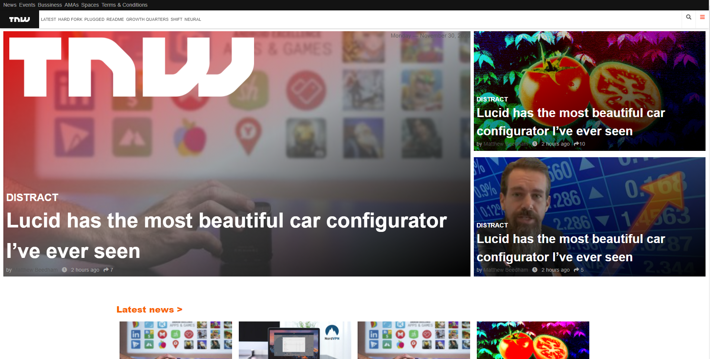
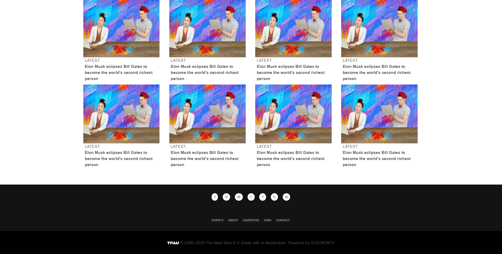

# TNW - TheNextWeb - Responsive design

> Snek Peak - Project 2 .. cloning NYtimes article webpage.

Additional description about the project and its features.

## Built With

- HTML
- CSS

Built with CSS responsive techniques as "Flex, Grid, MediaQueries"

## Live Demo

[Live Demo Link](https://jaimdedan.github.io/tnw_responsive/)

## Authors

👤 **Mohammed Atef**

- GitHub: [@MohammedAtef](https://github.com/Mohamed-js)

👤 **Jaim Delmar**

- GitHub: [@JaimDelmar](https://github.com/jaimdedan)

## 🤝 Contributing

Contributions, issues, and feature requests are welcome!

## Show your support

Give a ⭐️ if you like this project!

## Acknowledgments

- Hat tip to anyone whose code was used
- Inspiration
- etc

